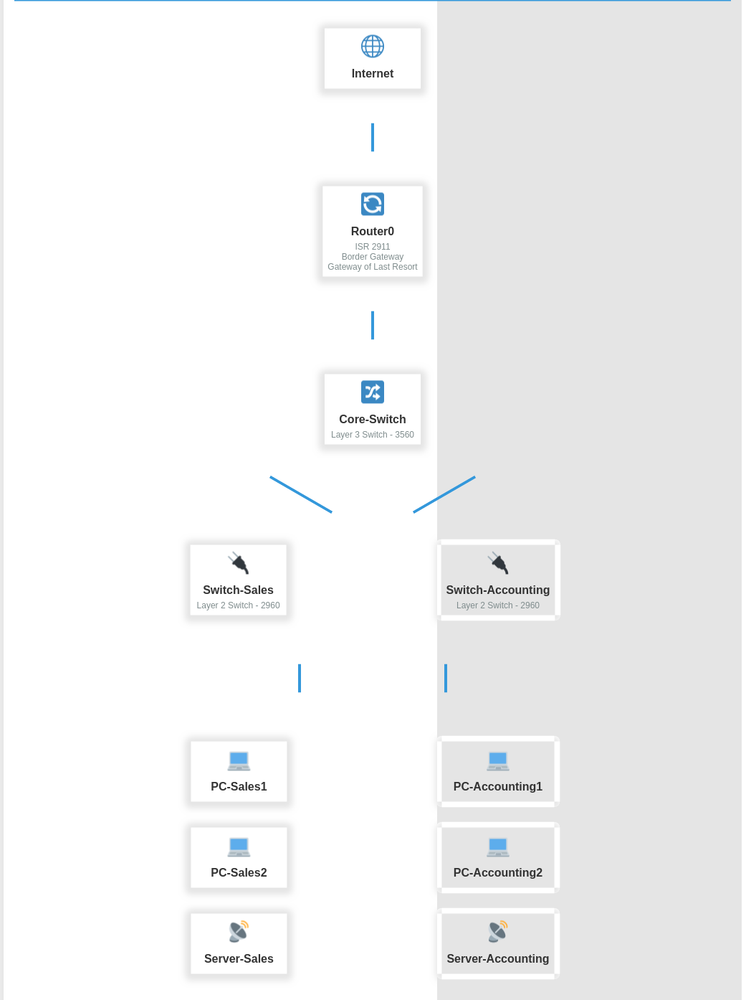

# Cisco Enterprise Network Simulation

A complete small-enterprise network built from scratch: two departments, inter-VLAN
routing, DHCP, NAT to the internet edge, and a hardened management plane on every device.
CCNA-level design, configured the way it would be handed over rather than the way it is
taught.

## Topology

| Device | Role |
|---|---|
| `SW-SALES` | Access switch — user ports, port security, DHCP snooping, DAI |
| `CORE-SWITCH` | Layer 3 switch — SVIs and inter-VLAN routing |
| `BORDER-ROUTER` | Edge — DHCP pools and NAT overload to the internet |

| VLAN | Purpose | Subnet |
|---|---|---|
| 10 | Sales | 192.168.10.0/24 |
| 20 | Accounting | 192.168.20.0/24 |
| 99 | Management | 192.168.99.0/24 |
| 999 | Parking VLAN for unused ports | — |

## Security baseline

Every device carries the same management-plane baseline, which is the part usually left
out of a CCNA lab: AAA with local authorisation, SSH only with a 2048-bit key, an access
class restricting vty to the management subnet, exec timeouts, a login banner, syslog with
timestamps, and the unused services (BOOTP, source routing, plain HTTP) turned off.

The access switch adds the Layer 2 protections: port security with aging, DHCP snooping
with the uplink as the only trusted port, Dynamic ARP Inspection on top of the snooping
binding table, BPDU guard on user ports, and unused ports shut into a parking VLAN. The
native VLAN on the trunk carries no access port, so there is no untagged VLAN to hop into.

**No password is stored in this repository.** Every credential is a placeholder set on the
device at build time.

These configurations score 100% against
[network-config-compliance](https://github.com/ktf40858-stack/network-config-compliance),
my CIS Benchmark auditor.

## Files

- [`Layer 2 Switch Configuration`](Layer%202%20Switch%20Configuration)
- [`Layer 3 Switch Configuration`](Layer%203%20Switch%20Configuration)
- [`Router Configuration`](Router%20Configuration)

## Related work

- [l2-attacks-and-mitigations](https://github.com/ktf40858-stack/l2-attacks-and-mitigations) —
  the attacks the Layer 2 protections above are there to stop, each demonstrated.
- [network-config-compliance](https://github.com/ktf40858-stack/network-config-compliance) —
  auditing these configurations automatically.

## Author

Kodjo Apedoh — Network & Cloud Security · Arlington, VA
[LinkedIn](https://www.linkedin.com/in/kodjo-apedoh-03030990/) · [Other labs](https://github.com/ktf40858-stack)
